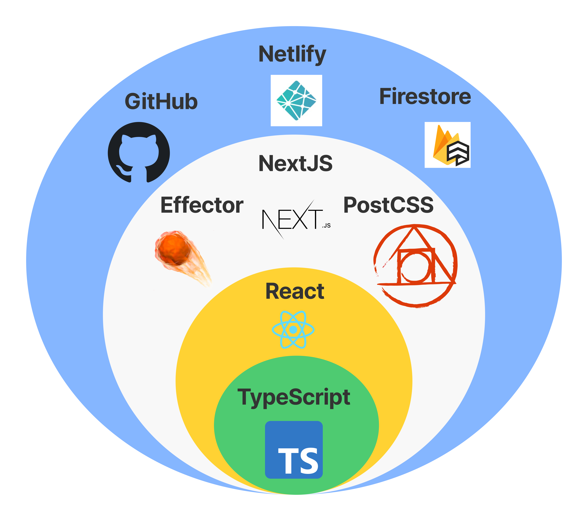

# Victor Kugay Blog

[](https://app.netlify.com/sites/nervous-hamilton-710e37/deploys)
[](https://app.travis-ci.com/ViktorKugay/frontend-blog)
[](https://codeclimate.com/github/ViktorKugay/frontend-blog/maintainability)
[](https://codeclimate.com/github/ViktorKugay/frontend-blog/test_coverage)

## Table Of Contents

  - [Description](#description)
  - [Installation](#installation)
  - [Start](#start)
  - [Pages](#pages)
  - [Entry Points](#entrypoints)

## Description

This repository was created by Viktor Kugay and stores the source code of [vkugay.ru](https://vkugay.ru) web application. [vkugay.ru](https://vkugay.ru) includes list of articles, posts and pet projects. The purpose of this app is to provide information and share knowledge about web development.

This web application is developed using [TypeScript](https://www.typescriptlang.org/), [React](https://ru.reactjs.org/), [Effector](https://github.com/effector/effector), [Atomic Web Design](https://bradfrost.com/blog/post/atomic-web-design/), [PostCSS](https://github.com/postcss/postcss), [NextJS](https://nextjs.org/), [Google Firestore](https://firebase.google.com/docs/firestore) and hosted on [Netlify](https://www.netlify.com/). 

<div align='left'>
  
</div>

## Pages

- [https://vkugay.ru/](https://vkugay.ru) - list of posts and projects
- [https://vkugay.ru/post/:postSlug](https://vkugay.ru/post/strategic_domain_driven_design_and_enterprise_architecture) - the post page

## Installation

```bash
# install all dependencies
$ yarn install
# copy example envs to local env file
$ cp .env.example .env.local
# build posts content to json file
$ yarn build:posts
```

## Start

```bash
# start development next build
$ yarn dev
```

## EntryPoints

- **posts** - [vkugay.ru](https://vkugay.ru) posts in Markdown
- **scripts** - scripts for deploy web application
- **pages** - pages for [NextJS](https://nextjs.org/) routing
- **src/frontend/components** - UI components which use [Atomic Web Design](https://bradfrost.com/blog/post/atomic-web-design/)
- **src/frontend/services** - services (_Firestore_) which fetch/create/update/delete data from external resources
- **src/frontend/store** - the app stores (_Posts_, _Metrics_) which use [Effector](https://github.com/effector/effector) to manage app data
- **src/frontend/styles** - global application _scss_ styles